# mimicfox

A Cutting edge firefox minimal style userChrome.css that enhance Windows 11 mica and mimic Microsoft Edge with several community themes inspired.

## Preview

###### click image show light/dark theme comparison

## Installation

1. Download [code](https://github.com/rainbowflesh/mimicfox/archive/refs/heads/main.zip) or clone this [repo](https://github.com/rainbowflesh/mimicfox.git)
2. Unzip and move to `about:profiles` > `Profile` > `Root Directory`, change folder name to `chrome`.
3. Go to [about:config](about:config), change following preference

   > `toolkit.legacyUserProfileCustomizations.stylesheets` = `true`

   > `svg.context-properties.content.enabled` = `true`

4. Restart browser, or `firefox.exe -purgecaches`.

### Available configs

> [!TIP]
> Notes: Your need turn on some configs in your `about:config` manually.

| preference name                          | value                         | description                                                                                                                                                    |
| ---------------------------------------- | ----------------------------- | -------------------------------------------------------------------------------------------------------------------------------------------------------------- |
| `browser.tabs.allow_transparent_browser` | true                          | Allow browser framework transparent                                                                                                                            |
| `toolkit.tabbox.switchByScrolling`       | boolean                       | switchByScrolling.gif                                                                                                                                          |
| `uc.plugin.edge-frfox`                   | true                          | Enable edge-frfox styles                                                                                                                                       |
| `uc.plugin.sidebery`                     | boolean                       | Sidebery compatible, copy everything in `./sidebery.css` to make sidebery looks like native vertical tab styles                                                |
| `uc.plugin.simpleMenuWizard`             | boolean                       | To use simpleMenuWizard put entire `simpleMenuWizard-master` to `./plugins/`                                                                                   |
| `uc.tweak.acrylic-color`                 | null or 0 or 1 or 2           | Greeter, grayer                                                                                                                                                |
| `uc.tweak.always-show-navbar-button`     | boolean                       | 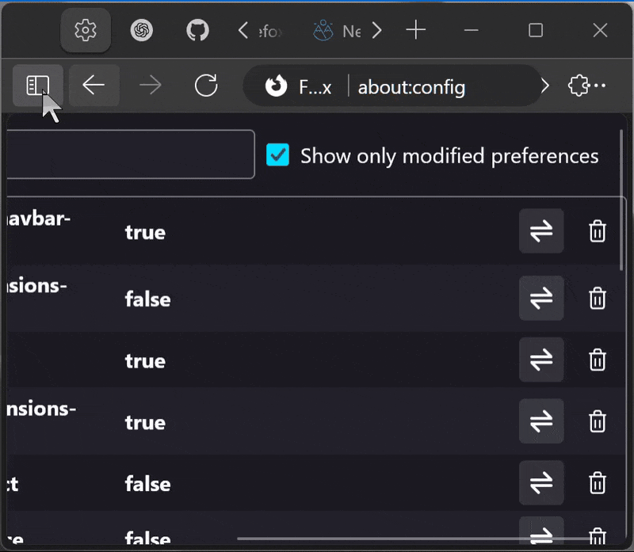 Always show navbar buttons even window really have no space for them                                      |
| `uc.tweak.always-show-tab-close-button`  | boolean                       | 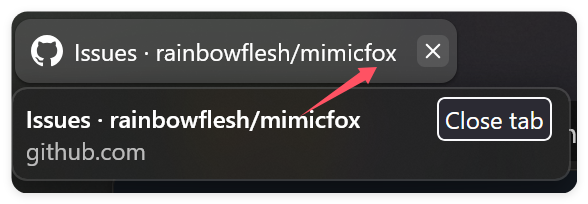Always show tab close button, or show only on hover                                                         |
| `uc.tweak.animation.page-loading`        | null or 0 or 1 or 2 or 3 or 4 | [nebula-tab-loading-animation](https://github.com/JustAdumbPrsn/Zen-Nebula/blob/main/Nebula/Nebula-config.css)                                                 |
| `uc.tweak.animation.page-showing`        | null or 0 or 1 or 2 or 3 or 4 | [nebula-tab-switch-animation](https://github.com/JustAdumbPrsn/Zen-Nebula/blob/main/Nebula/Nebula-config.css)                                                  |
| `uc.tweak.browser-rounded-padding`       | null or 0 or 1 or 2 or 3 or 4 | Every value add 0.5em extra padding 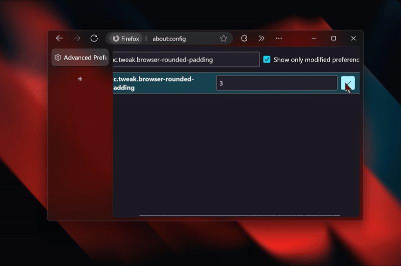                                                                         |
| `uc.tweak.compact-extensions-menu`       | boolean                       | 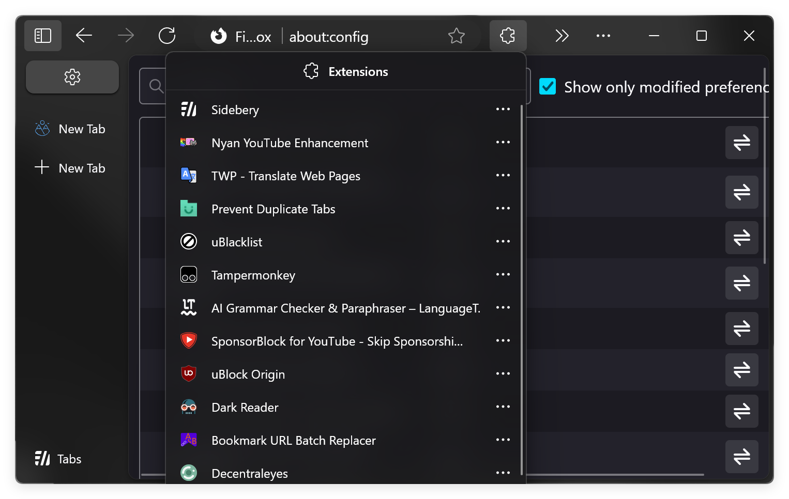                                                                                                                          |
| `uc.tweak.dynamic-tabbar`                | true                          | Same feature from <https://github.com/mbnuqw/sidebery/wiki/Firefox-Styles-Snippets-(via-userChrome.css)#dynamic-native-tabs-for-hiding-native-horizontal-tabs> |
| `uc.tweak.enable-nebula-animations`      | true                          | Enable animations from [nebula](https://github.com/JustAdumbPrsn/Zen-Nebula)                                                                                   |
| `uc.tweak.floating-tabs`                 | true                          | 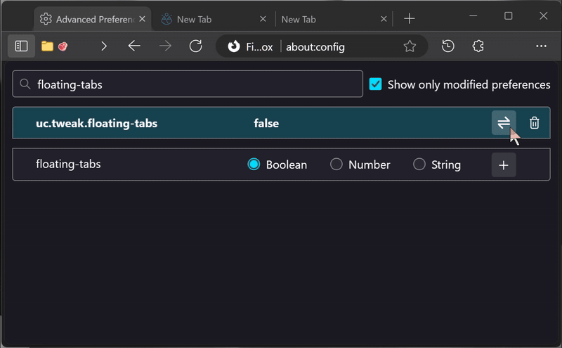                                                                                                                       |
| `uc.tweak.icon-only-extension-menu`      | boolean                       | 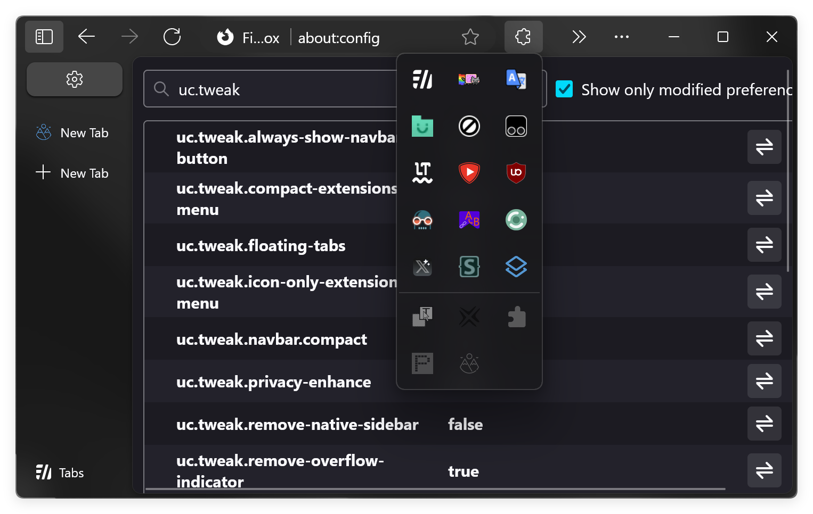                                                                                                                          |
| `uc.tweak.navbar.compact`                | boolean                       | 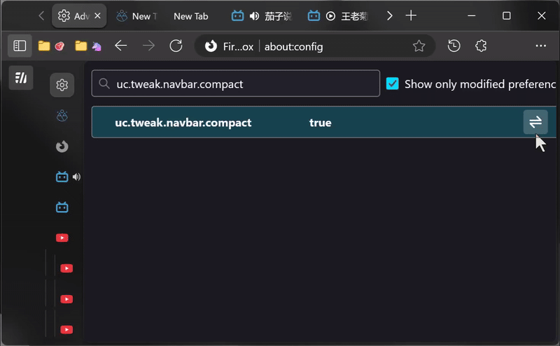                                                                                                                      |
| `uc.tweak.pip`                           | true                          | Enable Picture-in-Picture styles 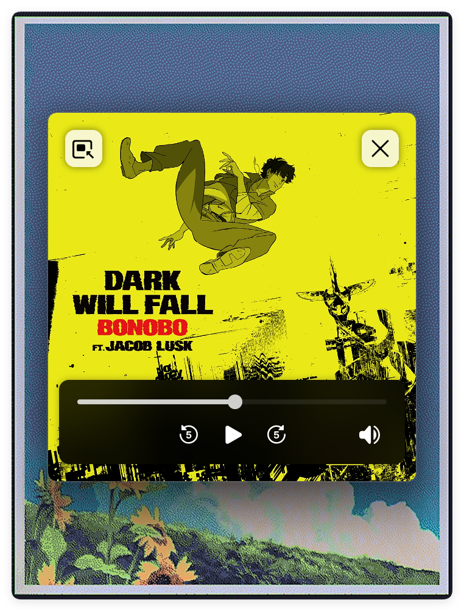                                                                                                |
| `uc.tweak.privacy-enhance`               | boolean                       | 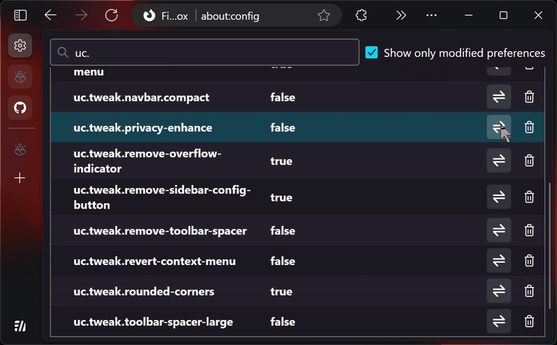                                                                                                                     |
| `uc.tweak.remove-native-sidebar`         | boolean                       | 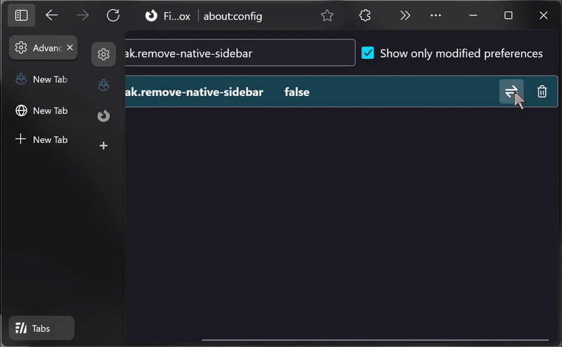                                                                                                               |
| `uc.tweak.remove-overflow-indicator`     | boolean                       | 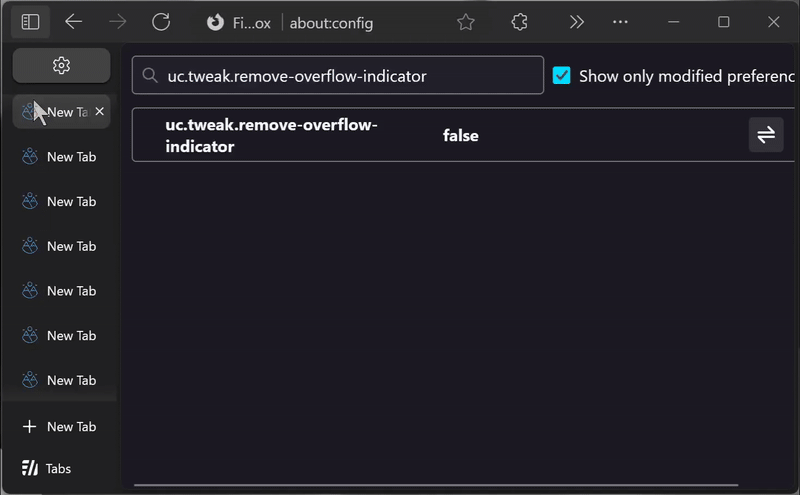                                                                                                           |
| `uc.tweak.remove-sidebar-button-group`   | boolean                       | 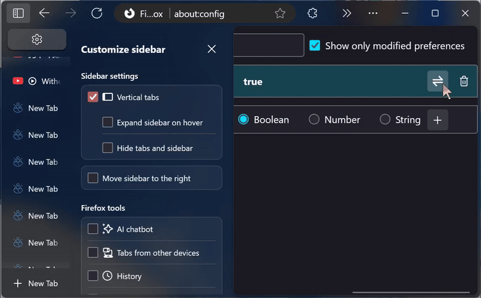                                                                                                        |
| `uc.tweak.remove-sidebar-config-button`  | boolean                       |                                                                                                         |
| `uc.tweak.remove-tab-close-button`       | boolean                       | 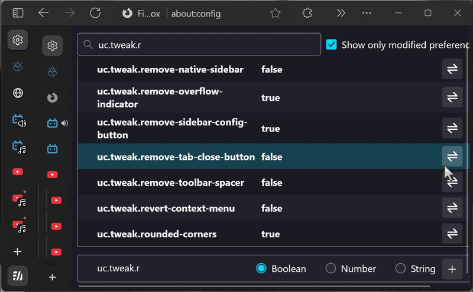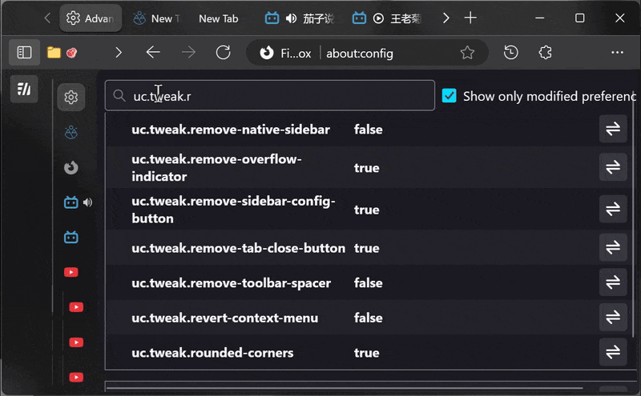                                                          |
| `uc.tweak.remove-toolbar-spacer`         | boolean                       |                                                                                                                |
| `uc.tweak.revert-context-menu`           | boolean                       | Disable custom context menu css                                                                                                                                |
| `uc.tweak.rounded-corners`               | true                          | 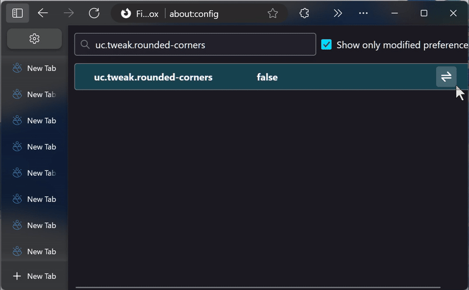                                                                                                                     |
| `uc.tweak.sort-extensions`               | true/false                    | Sort extension items by alphabet                                                                                                                               |
| `uc.tweak.toolbar-spacer-large`          | boolean                       | 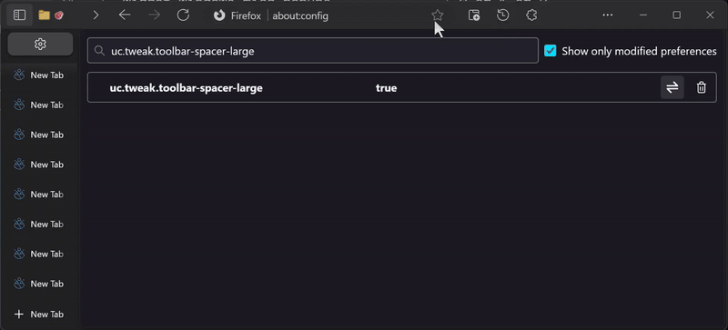                                                                                                                |
| `uc.tweak.urlbar-button`                 | null or 0 or 1 or 2           | Chose to show urlbar buttons with none hide (0), hide on left (1), or hide on right(2) 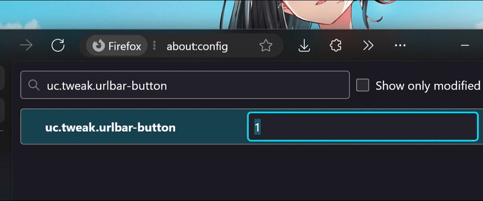                                |
| `widget.windows.mica.extra`              | true                          | Enable custom extra mica content (Require [MicaForEveryone](https://github.com/MicaForEveryone/MicaForEveryone))                                               |
| `widget.windows.mica.popups`             | 0 or 1 or 2                   | Disabled / Enabled / Auto (Firefox 138+)                                                                                                                       |
| `widget.windows.mica.popups`             | true                          | (Firefox 137)                                                                                                                                                  |
| `widget.windows.mica.toplevel-backdrop`  | 0 or 1 or 2 or 3              | Auto / Mica / Acrylic / MicaAlt (Firefox 138+)                                                                                                                 |
| `widget.windows.mica`                    | true                          | Enable mica effect on Windows 10/11                                                                                                                            |

> [!IMPORTANT]
> Firefox are super dynamic on sidebar width, you will encounter unwanted sidebar size and tab size without adjusting by yourself in `./sidebar` and `./sidebery`.

### Your personal customization override
Edit `./custom.css`

## Relate links

- https://github.com/bmFtZQ/edge-frfox
- https://github.com/muckSponge/MaterialFox
- https://github.com/Guerra24/Firefox-UWP-Style
- https://github.com/Aris-t2/CustomJSforFx
- https://github.com/mbnuqw/sidebery
- https://github.com/joelshepherd/tabliss
- https://github.com/MicaForEveryone/MicaForEveryone
